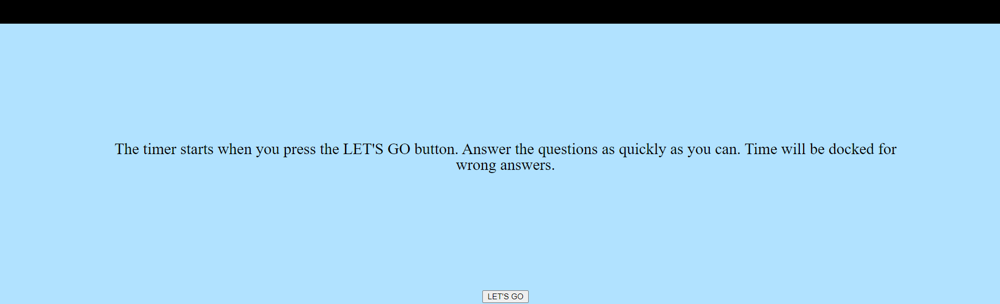

## Description

This is a quiz quiz with a timer. Time is docked for missed answers. You start the quiz by clicking on LET'S GO and then answer the questions presented.

- I wanted wanted the user to start the quiz and answer the questions. At the end you would see your score and be able to put your initials in. You can also restart the quiz and log new scores. You can also reload the app.
- This project pushed my initial limits as a coder and learning through this process will give me the skill needed to continue my career in coding.
- It makes navigation of the page simple and lets you know exactly how to use the application.
- I learned how to be able to add a timer and also taught me how to cycle through other questions.

## URL Directory

- https://dhealy83.github.io/web-apis-challenge/

## Usage

- When you open the page you are directed to click on the LET'S GO button to start the quiz and the timer.
- The first question will prompt you to select from one of three answers. Pick an answer. If you are incorrect you will be docked time. If you are correct you will be rewarded points.
  If you finish in the alloted time you will be able to put you initial in to track your high score.
- if you do not finish in the time alloted you get an alert telling you that your out of time and you have to start over.

